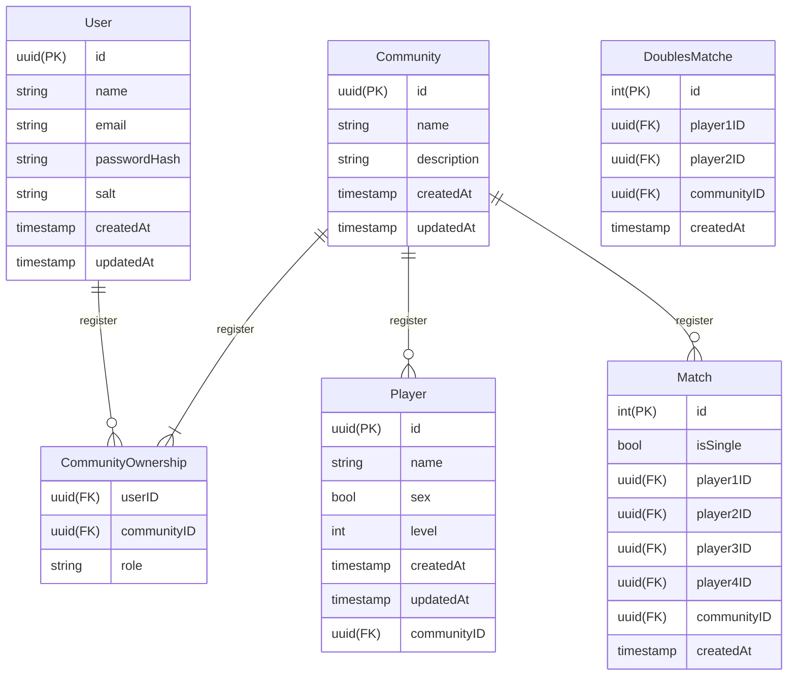

```mermaid
erDiagram
    User ||--o{ CommunityOwnership : register
    User {
        uuid(PK) id
        string name
        string email
        string passwordHash
        string salt
        timestamp createdAt
        timestamp updatedAt
    }

    CommunityOwnership {
        uuid(FK) userID
        uuid(FK) communityID
        string role
    }

    Community ||--|{ CommunityOwnership : register
    Community ||--o{ Player : register
    Community ||--o{ Match : register
    Community {
        uuid(PK) id
        string name
        string description
        timestamp createdAt
        timestamp updatedAt
    }

    Player {
        uuid(PK) id
        string name
        bool sex
        int level
        timestamp createdAt
        timestamp updatedAt
        uuid(FK) communityID
    }

    Match {
        int(PK) id
        bool isSingle
        uuid(FK) player1ID
        uuid(FK) player2ID
        uuid(FK) player3ID
        uuid(FK) player4ID
        uuid(FK) communityID
        timestamp createdAt
    }

    DoublesMatche {
        int(PK) id
        uuid(FK) player1ID
        uuid(FK) player2ID
        uuid(FK) communityID
        timestamp createdAt
    }
```
